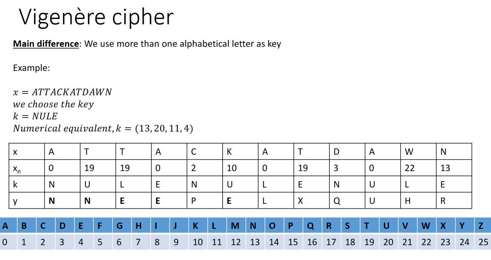
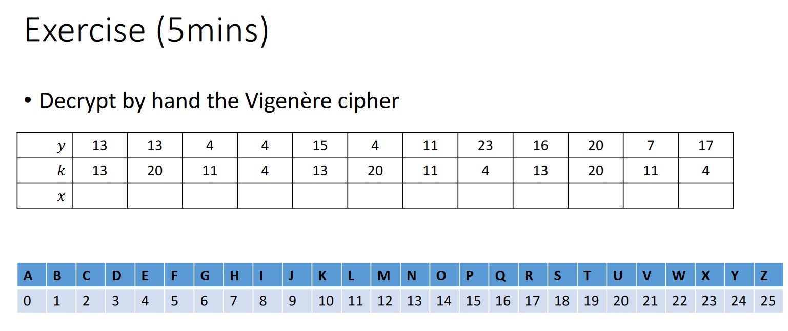
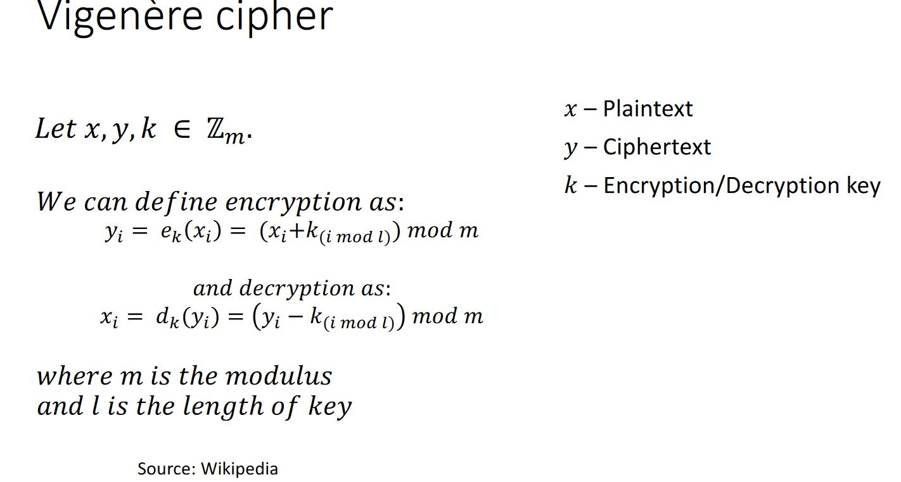
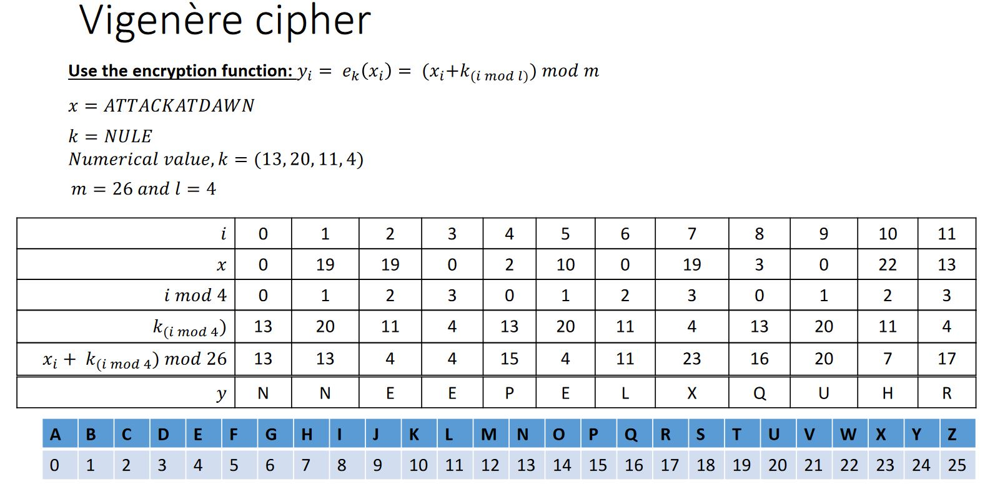
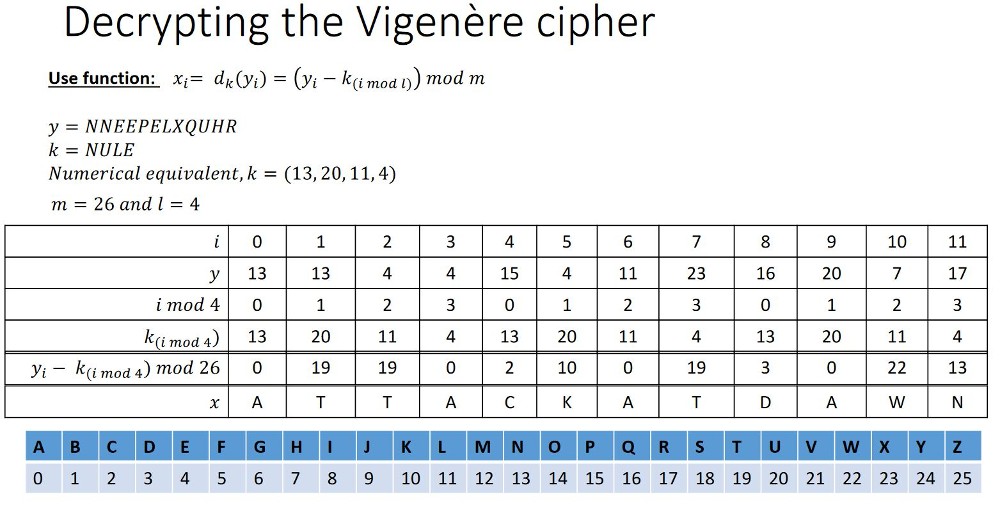

#### Polyalphabetic Cryptosystem

- Affine cipher is a monoalphabetic cryptosystem
- In polyaphabetic cipher
  - More than one alphabets are used to encrypt the plaintext.
  - The main pupose is to defeat frequency analysis attack

#### Vigenere cipher

#### Exercise

#### More vigenere cipher

#### Encryption function

#### Decryption

#### Cryptoanalysis of Vigenere cipher

- Frequency analysis:

  - if you know the length of the keyword is n, you can break the ciphertext into n cosets and attack the cipher using frequency analysis if the ciphertext sample is long enough

- Friedman Test

  - Find the incidence of Coincidence to determine wether or not a polyalphabetic substition has been used
  - It is the probability that two randomly selected letters are the same

- Kasiski.
  - Uses the occasional aligning of groups of letters with keyword to determine the length of the keyword.
